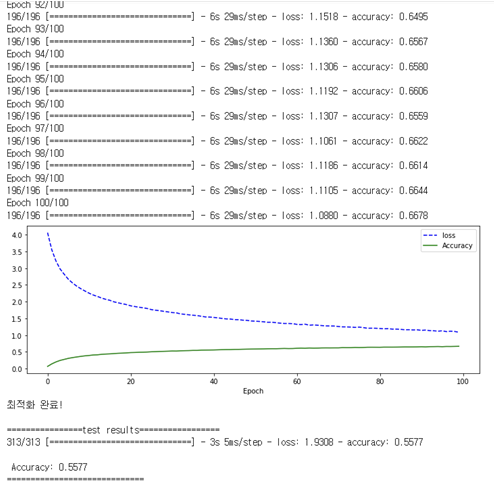

AI cifar - 인공지능 수업 AI Hackaton

 

## 프로젝트 주제
CNN + RNN을 결합한 모델로 Cifar-100 데이터셋 학습 정확도 올리기

 
  
## 프로젝트 기간
2021.12.02 ~ 2021.12.07

 
  
## 결과

### CNN 모델 구조
| 입력층 | Conv1 | maxpooling | drop out | Conv2 | drop out | Conv3 | maxpooling | drop out | Conv4 |
| -- | -- | -- | -- | -- | -- | -- | -- | -- | -- |
| 32X32 | 3X3X128 | | 0.2 | 3X3X256 | | 0.25 | 3X3X512 | | 0.6 | 3X3X16 |

### RNN 모델 구조
| 입력차원  | 1번 LSTM 레이어 | 2번 LSTM 레이어 | 3번 LSTM 레이어 | Flatten | FC | drop out | FC |
| -- | -- | -- | -- | -- | -- | -- | -- |
| | 유닛수 : 32 return_sequence | 유닛수 : 32 return_sequence | 유닛수 : 32 return_sequence | | 1024 | 0.6 | 100 |

### accuracy

### 분석
| 에폭 | 배치 사이즈 |
| -- | -- |
| 100 | 256 |

### 순위
| accuracy | 순위 |
| -- | -- |
| 55.77% | 2등 |

 
  
## 특이사항
이미지 분류 모델에서 잘 안쓰이는 RNN을 추가하는 제약조건 때문에 accuracy가 잘 올라가지 않았습니다. 100개의 클래스에 각 600장 이미지가 있는 데이터셋입니다.